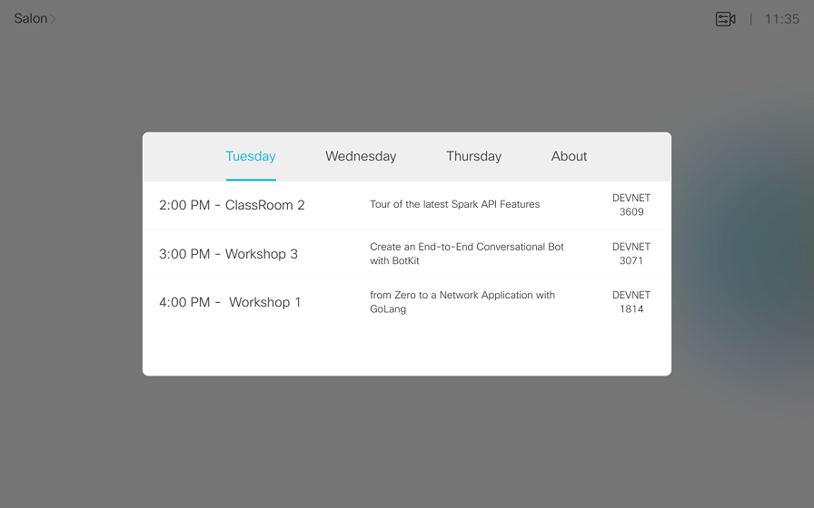

# Example of a static Agenda

**New to Controls & Macros? check the [QuickStart Guide](../../QuickStart.md) to learn to load Controls and Macros to your device**

This control does not invoke any macro, simply displays a static agenda.

With the example of my schedule at Cisco Live Europe 2018 - Barcelona

