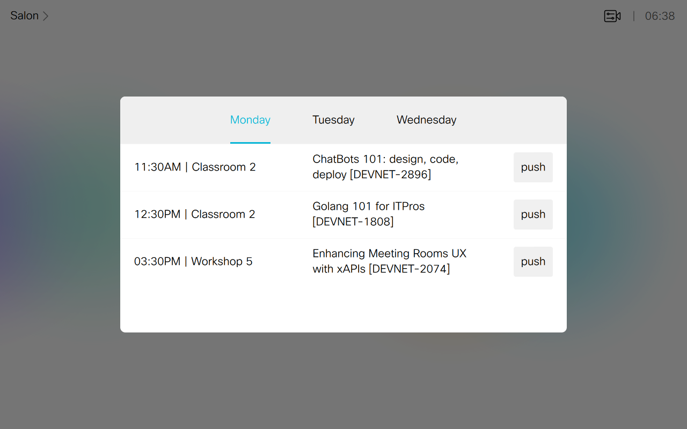
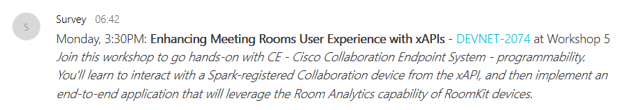

# Agenda with notifications

This agenda pushes session details to a Webex Teams space (via an incoming Webhook)




## Quickstart

Deploy the [control](./agenda.xml) to your device

Create an [incoming webhook](https://apphub.webex.com/categories/other/integrations/incoming-webhooks-cisco-systems) from Webex App Hub Integrations

Run the JS script.
_Make sure to add an extra `INCOMING_WEBHOOK_ID` env variable filled with the identifier created earlier_

```shell
git clone https://github.com/ObjectIsAdvantag/xapi-samples
cd controls
cd agenda_notif
npm install
INCOMING_WEBHOOK_ID="XXXXX" JSXAPI_DEVICE_URL='ssh://192.168.1.34' JSXAPI_USERNAME='integrator' JSXAPI_PASSWORD='integrator' node agenda.js
```

Press 'push' and see messages poping up in Webex Teams.

