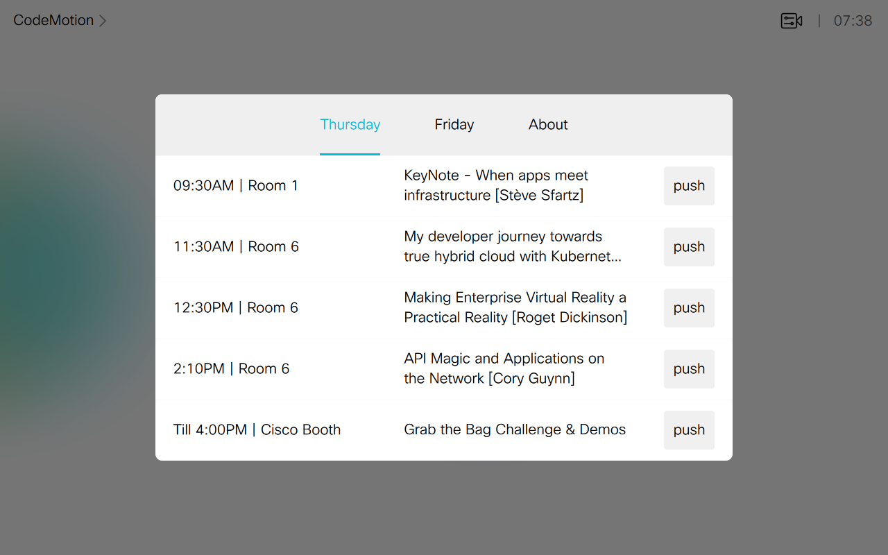
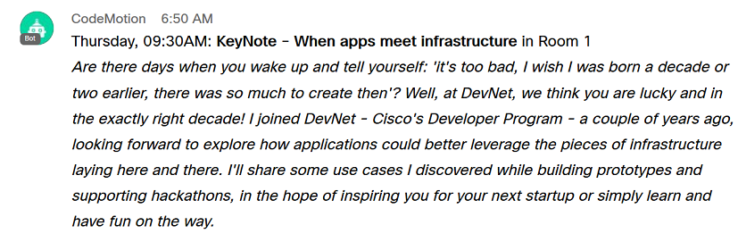

# Agenda with notifications (via Bot Account)

This agenda pushes session details to a Webex Teams space, via a Bot Account posting to the space.




## Quickstart

Deploy the [control](./agenda.xml) to your device

Create a [bot account](https://apphub.webex.com/categories/other/integrations/incoming-webhooks-cisco-systems) from Webex for Developers, and paste the bot token into the code below.

Run the JS script.

```shell
git clone https://github.com/ObjectIsAdvantag/xapi-samples
cd controls
cd agenda_post
npm install
JSXAPI_DEVICE_URL='ssh://192.168.1.34' JSXAPI_USERNAME='integrator' JSXAPI_PASSWORD='integrator' node agenda.js
```

Press 'push' and see messages poping up in Webex Teams.

