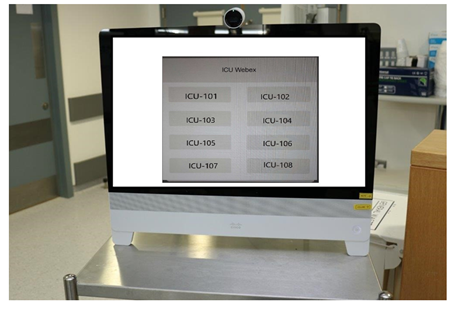

# Intensive Care Unit - Family Link

The WebexQuickDial XML menu presents a simple way for clinical staff to start a Personal Meeting Room for a bedspace (below showing ICU-101 -> ICU-108)

The WebexQuickDial.js file initiates a call into Personal Meeting Room related to individual buttons:

- MATCH_STRING: uses the value entered in the XML file for the respective button
- const DIALPREFIX_WEBEXURL: this value is replaced with the text on the button control after wqd- and will use it to join the actual PMR
- const DIALPREPOSTFIX_WEBEXURL: this is the customer’s webex site
- const DIALPOSTFIX_WEBEXURL: '@webex.com'; added after the customer’s site
- let hostpin = '1234'; this needs to change, and reflect the actual Host PIN configured for the PMR
