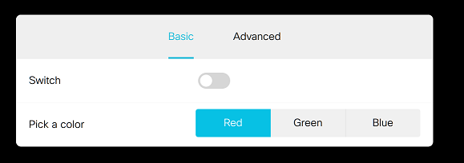
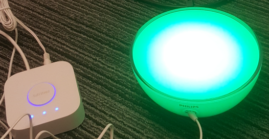

# Philips Hue demo

Control a Philips Hue Light from a Cisco Collaboration Device.

Steps:
- Open the [macro](./macro.js) and update BRIDGE_IP, BRIDGE_USER with your deployment info
- Load the macro and the panel to your CE9.6+ capable device

