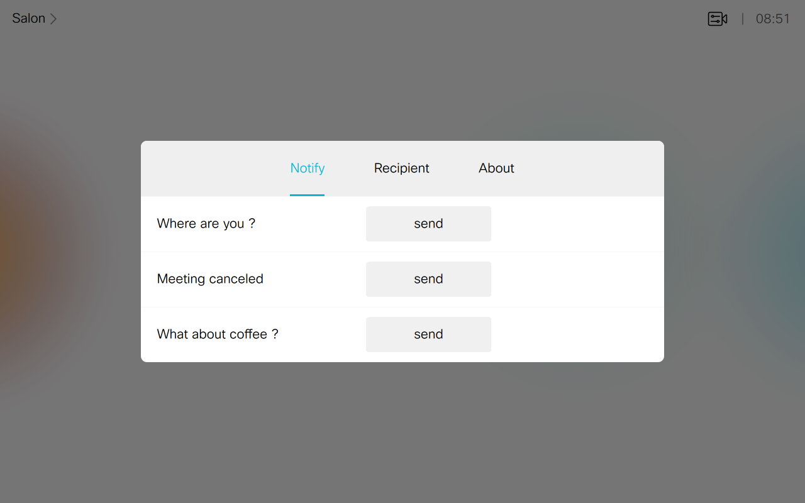
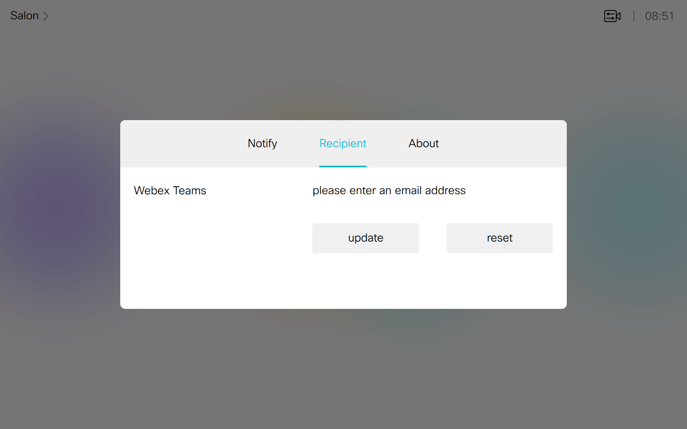
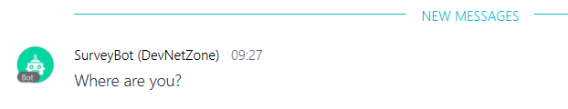

# Webex Teams Notifier

In-Room Control that lets users set and update an email address, and sends Webex Teams notifications to this email  via a bot.






## Quickstart 

Deploy the [control](./notifier.xml) to your device

Run the `notifier.js` script from a bash command line:

```shell
git clone https://github.com/ObjectIsAdvantag/xapi-samples
cd controls
cd notifier
npm install
JSXAPI_DEVICE_URL='ssh://192.168.1.34' JSXAPI_USERNAME='integrator' JSXAPI_PASSWORD='integrator' node notifier.js
```

Press 'push' and see notifications poping up on your screen.

## Sending notifications to Webex Teams

Create a [Webex Teams bot account](https://developer.webex.com/add-bot.html) and paste the bot access token.

Run the `to_webex_teams.js` script from a bash command line:

```shell
git clone https://github.com/ObjectIsAdvantag/xapi-samples
cd controls
cd notifier
npm install
ACCESS_TOKEN="XXXXX" JSXAPI_DEVICE_URL='ssh://192.168.1.34' JSXAPI_USERNAME='integrator' JSXAPI_PASSWORD='integrator' node to_webex_teams.js
```

Press 'push' and see messages poping up in the Webex Teams space.



