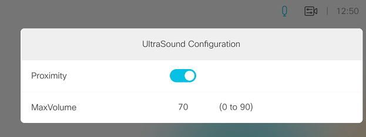

# Helper panel to switch Proximity Mode on/off

Simply press the toggle:

Note that the toggle will [automatically update](https://github.com/ObjectIsAdvantag/xapi-samples/blob/master/controls/proximity/ultrasound.js#L52) if the configuration is updated from the Room Device Admin UI.
