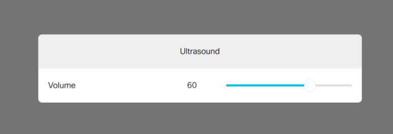

# Helper panel to update the Ultrasound MaxVolume

**New to Controls & Macros? check the [QuickStart Guide](../../docs/QuickStart.md) to learn to load Controls and Macros to your device**

Note that you can deploy the custom code logic for the Ultrasound panel:
- [as a Macro](./ultrasound-macro.js) 
- [as a standalone Node.js script](./ultrasound-jsxapi.js).
- or [as a script](./ultrasound-jsxapi.js) that can be used either as a Macro or a standalone script

Simply move the slider around.

_Note that a custom message is pushed to your device's Touch10/DX interface as Webex Teams pairing is enabled / disabled._
