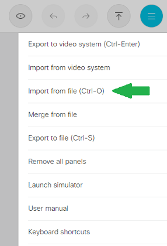
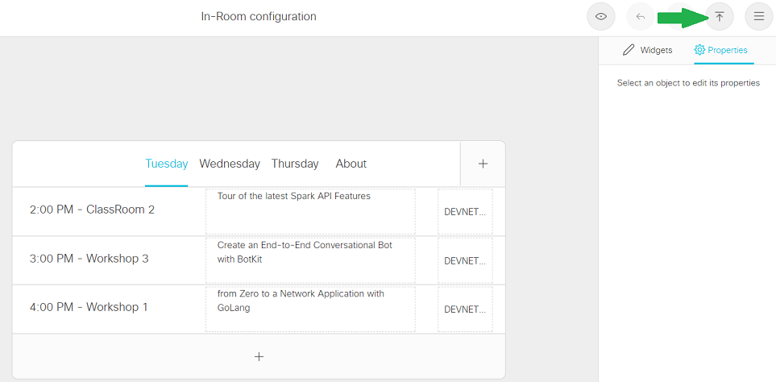
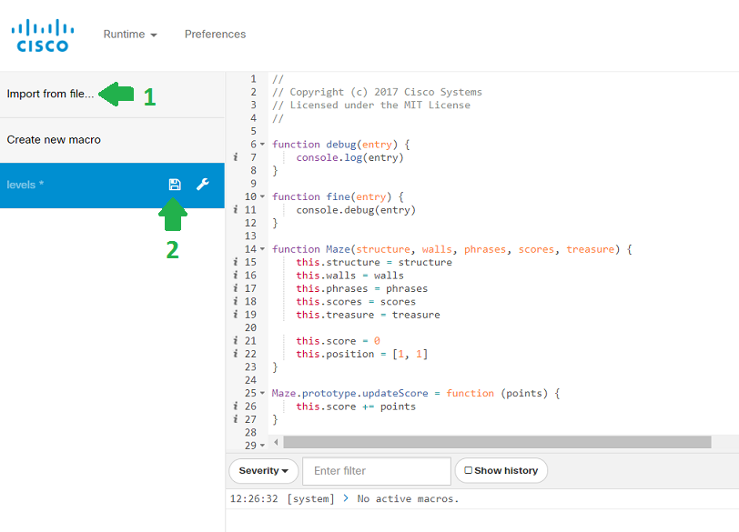
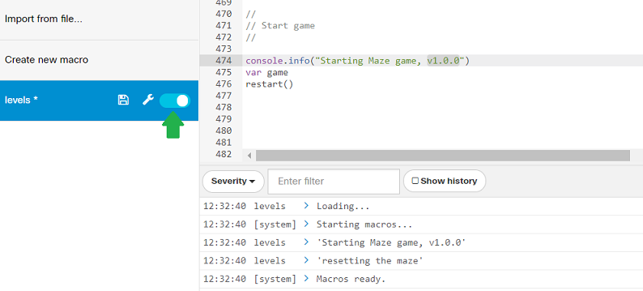

# QuickStart: Loading UI Extensions and Macros to a Collaboration Device

Follow the steps below to load Controls and Macros.

If you're looking for more details, check the [CE Customization Guide](https://www.cisco.com/c/dam/en/us/td/docs/telepresence/endpoint/ce99/sx-mx-dx-room-kit-customization-guide-ce99.pdf).

## Loading an In-Room Control

Connect to your Device's local Web interface by entering its ip address in a Web Browser, and authenticate with your admin credentials. Example: http://192.168.1.30

Launch the UI Extensions editor from the 'Integration > UI Extensions' Menu, and clicking the "Launch Editor" button. This would typically take you to http://192.168.1.30/web/roomcontrol/editor from the example above.

Open the top right menu, click "Import from file".

Supposing you've clone this repository, select the source XML file [agenda-CLEUR.xml](../controls/agenda/agenda-CLEUR.xml) placed in the 'controls/agenda' subfolder.

Now click the "Export configuration" button as show below to push the control to your device. 

The upload is instantaneous.
Simply reach to your Device and start using the control.

In the next step, you'll get details on how to push a JavaScript macro on the Device so that custom logic is executed as end-users interact with the controls.

## Loading a JavaScript Macro

First, repeat the steps above with the [levels.xml](../controls/levels/levels.xml) file placed in the 'controls/levels' subfolder, and push the control to the device.
You can now interact with the control, but nothing really happens as no logic has been deployed to the device yet.

Now, launch the Macro editor from the 'Integration > Macro Editor' Menu. This would typically take you to http://192.168.1.30/web/customization/macro from the example above.

Click "Import from file..." and select the source JS file [levels.js](../controls/levels/levels.js) placed in the same 'controls/levels' subfolder as shown in Step 1 below.

Click the 'Save' icon as shown in Step 2 above.

> If you get an error at this point, simply refresh the Web page. Example: hit http://192.168.1.30/web/customization/macro again. The  error is due to a User Interface timeout as the macro was pushed to the device. But no worries, the macro did got pushed.

The macro is now deployed on the Device.
To activate it, click the toggle, and check the logs show 'Macro ready'

> If you see any error in the logs, there's good chances you missed to deploy the Control associated to the macro.

Done. Enjoy the game, and start writing your own controls!
